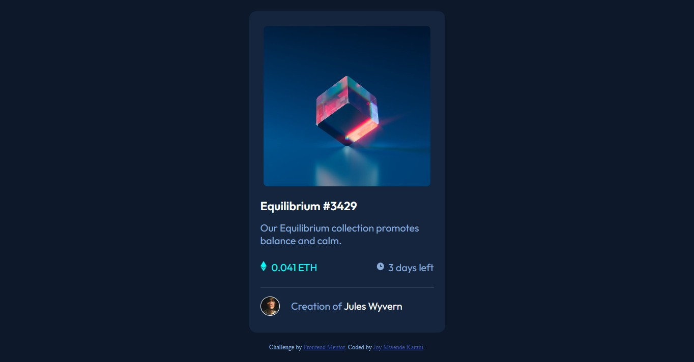
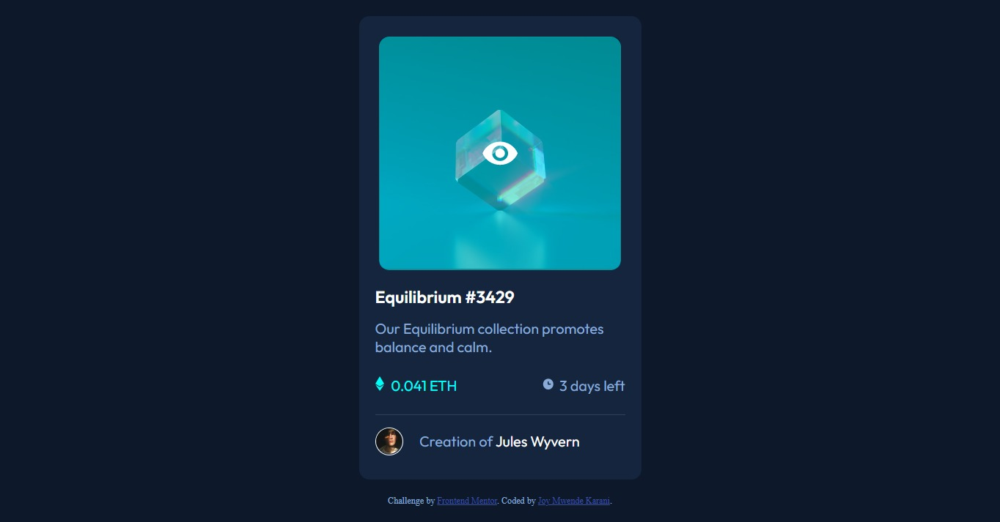

# Frontend Mentor - NFT preview card component solution

This is a solution to the [NFT preview card component challenge on Frontend Mentor](https://www.frontendmentor.io/challenges/nft-preview-card-component-SbdUL_w0U). Frontend Mentor challenges help you improve your coding skills by building realistic projects. 

## Table of contents

- [Overview](#overview)
  - [The challenge](#the-challenge)
  - [Screenshot](#screenshot)
  - [Links](#links)
- [My process](#my-process)
  - [Built with](#built-with)
  - [What I learned](#what-i-learned)
  - [Continued development](#continued-development)
  - [Useful resources](#useful-resources)
- [Author](#author)

## Overview

### The challenge

Users should be able to:

- View the optimal layout depending on their device's screen size
- See hover states for interactive elements

### Screenshot





### Links

- Solution URL: [Add solution URL here](https://your-solution-url.com)
- Live Site URL: [Add live site URL here](https://your-live-site-url.com)

## My process

### Built with

- Semantic HTML5 markup
- CSS custom properties
- Flexbox
- CSS Grid

### What I learned

I had some major learnings while working through this project. Here are some code samples:


```css
ul{
    list-style-type: none;
    display: flex;
    justify-content: space-between;
    padding: 25px 0;
    border-bottom: 1px solid hsl(215, 32%, 27%);
}
.card h2:hover{
    color: hsl(178, 100%, 50%);
    cursor: pointer;
}
```
Through this project, I got to learn more on how to work with the <ul> in CSS and also how to use :hover in my code.

### Continued development

The areas I want to continue focusing on in future projects include:
- Using flexbox and how to represent an element as a child of another element in CSS.
- Learning on how to center and align elements.

### Useful resources

- [Freecodecamp](https://www.freecodecamp.org/news/how-to-center-an-image-in-css/) - This helped me to learn how to center an image vertically using CSS in my code. I really liked this pattern and will use it going forward.

## Author

- Website - [Joy Mwende Karani](https://..........)
- Frontend Mentor - [@joykara](https://www.frontendmentor.io/profile/joykara)

